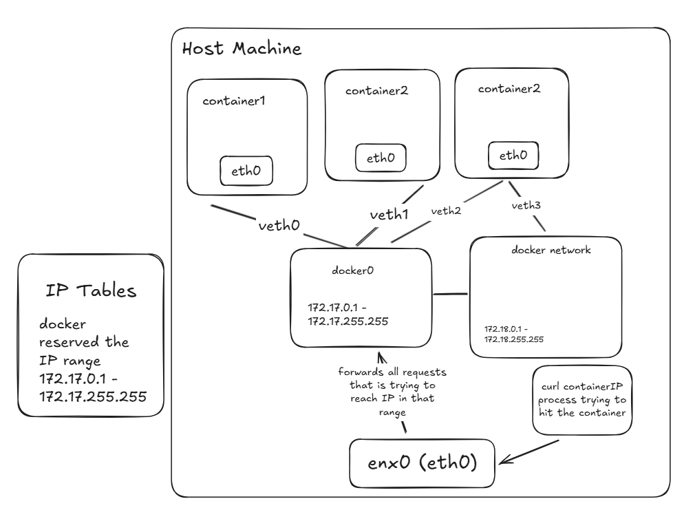

- Docker0 is a bridge network 
- In host network
  - when you create a container, it will directly connect to the host machine's network 
  - you can talk to the container directly on port 80 if you have a container running on port 80
  - if you try to create a new container that uses the same port then it will fail as one container is already is using the port
- Null network
  - no network 

