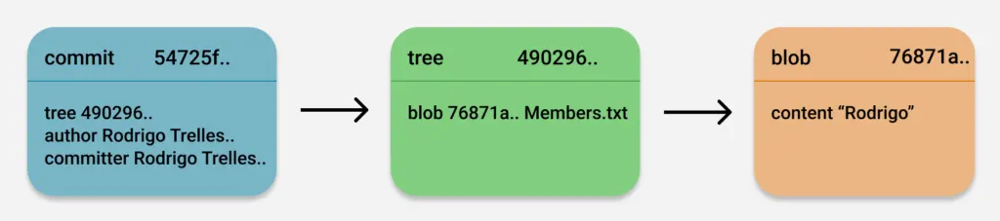
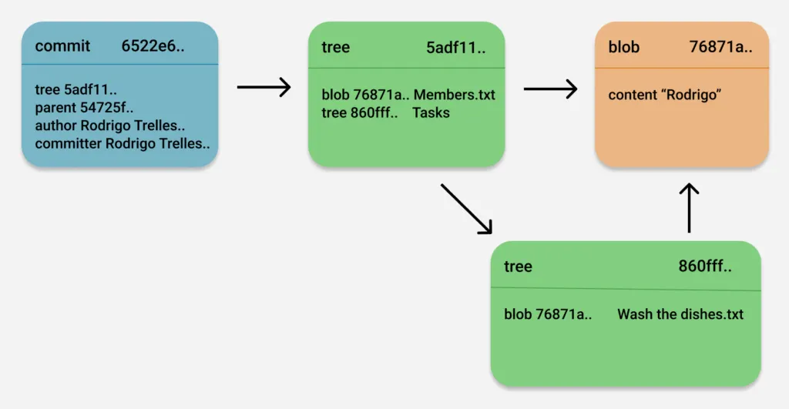
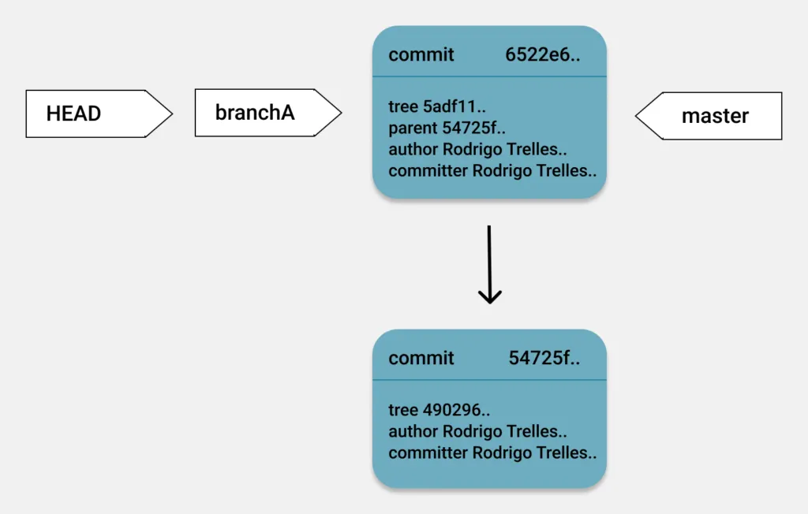

- Git has three fundamental object types - the blob, the tree, the commit
  - Commit
    - A commit is just plain text, and like any other content in Git, it was zipped, a hash was assigned to it and finally persisted in the objects repository. A commit object holds metadata, including the author, the committer, the commit date, and the commit message.
    - But the commit has something else too, it has a tree object 
    - if we cross search the hash mentioned with the tree, we will find another folder in the objects directory with the first two digits of the has as the folder name 
  - Tree
    - A tree is the object used to store directories in our project. A tree can point to other trees to build a complete hierarchy of files and subdirectories. It can also point to blobs.
    - Each commit points to a tree object that captures, in one complete snapshot, the state of the repository at the time the commit was performed.
    - The tree object contains one line per file or subdirectory. For each of them, it records permissions, object type, object hash, and filename.
    - The tree also has a hash in each line to a blob 
  - Blob
    - Blob is a contraction of “binary large object” and it holds a file’s data, but does not contain any metadata about the file or even its name. Each version of a file is represented as a blob.
  - 
  - Reference - [text](https://octobot.medium.com/how-git-internally-works-1f0932067bee)
  - 
  - When you have the same content in two different files, git gives the same blob id to both of them and points both files to the same blob, this is done to reduce space and also cause the same content will always give the same hash 
  - This is why git handles the filenames in a git folder structure, it is cause it needs to control this process 
  - Each commit has a reference to parent commit which is the hash of the immediate previous commit
  - But hashes are 40 character alphanumerals which is hard to remember, that is why git offers refs in refs folder of .git that will enable you to add commit messages
  - When you create a new branch, the branch will have the commit message of the branch it started from, if main had two commits and then you created a new branch, it will refer to the second commit of the main branch as that is the starting point of this branch
  - Git tracks the current branch with the HEAD file in the root directory 
  - HEAD is basically a pointer to another pointer 
  - It points to the current branch in the ref directory and that ref points to the commit 
  - 
  - After you commit something new in the new branch, the commit reference in the branch ref changes to the new commit, the HEAD and the master branch stays unchanged
  
  Let’s summarize the 5 most important points of this article:

Git stores three types of objects in its database: commits, trees, and blobs. Every object in the Git database has a hash key associated with it.
With commits, trees, and blobs and using their hash keys as pointers, Git builds our project’s data hierarchy efficiently and without duplicating content.
Hash keys are not easy for the human mind to remembere and that is why Git provides a more friendly way of remembering hashes: The references. We have branches, HEAD, and tags.
The branch is a pointer to a commit. The default branch name in Git is master, but you can create as many as you want. The HEAD reference tells us which branch we are currently working on. Every time you create a new commit, the branch pointer moves forward automatically.
Lastly, the tag reference is immutable and is always linked to the same commit to be able to always remember a moment in time.

### How Git "Stores" Changes: Snapshots, Not Deltas

When you make a commit, Git doesn't record just the lines you've added or removed. Instead, it essentially takes a picture of your entire project at that moment. Here’s how it breaks down:

1.  **Blobs:** The content of every file you've ever committed is stored in an object called a **blob**. Each blob is identified by a unique SHA-1 hash, which is generated from the file's content. If you have two files with the exact same content, they will point to the same blob, saving space.

2.  **Trees:** Git then creates **tree** objects. A tree represents a directory in your project. It contains a list of blobs (representing files in that directory) and other trees (representing subdirectories), along with their filenames. The tree object also has its own SHA-1 hash, which is calculated based on its contents.

3.  **Commits:** Finally, a **commit** object is created. This object contains:
    * The SHA-1 hash of the main tree object, which represents the root of your project at the time of the commit.
    * The hash of the parent commit(s), creating a linked history.
    * Author and committer information.
    * The commit message.

So, when you "change" a file, you're actually creating a new blob with the new content and a new hash. This change ripples up, creating new tree objects with new hashes, and ultimately a new commit object with its own unique hash.

### Is a Hash Enough to Find Differences?

Yes and no. A hash is an **identifier**, not a description of the changes. Here's the crucial part:

* **Identifying a change:** If the SHA-1 hash of a file in a new commit is different from its hash in the previous commit, Git knows the file has been modified. The hash itself is enough for Git to *detect* a change.

* **Seeing the differences:** To actually see what the changes are (the "diff"), Git needs to do a comparison. It retrieves the content of the two blobs (the old and the new) using their respective hashes and compares them on the fly to generate the differences you see when you run `git diff`.

So, while the hash tells Git that something is different, it doesn't contain the changes themselves. Think of it like having two documents with different version numbers; you know they're different, but you still need to read them to find out what changed.

### Where Do All the Changes Get Saved?

All of these Git objects—blobs, trees, and commits—are stored in the `.git/objects` directory of your repository.

Initially, each object is saved as a separate "loose" object file. The filename is derived from its SHA-1 hash. For example, a blob with the hash `e69de29bb2d1d6434b8b29ae775ad8c2e48c5391` would be stored in `.git/objects/e6/9de29bb2d1d6434b8b29ae775ad8c2e48c5391`.

However, to save space and improve efficiency, Git periodically packs these loose objects into a single compressed file called a **packfile** (with a corresponding index file). These are also located in the `.git/objects` directory, within a `pack` subfolder.

Inside a packfile, Git uses a clever technique called **delta compression**. For files that are similar, Git will store one of them as a complete file (a "base") and then store the other similar files as just the differences (deltas) from that base. This is where the storage of "changes" in a more traditional sense happens, but it's an optimization detail, not the fundamental way Git thinks about your project's history.

In summary, your changes are saved as new, complete versions of files (blobs) within the `.git` directory, which are then efficiently compressed and stored in packfiles. The hashes act as the essential pointers that allow Git to navigate this web of objects and reconstruct any version of your project or compare any two versions to find the differences.